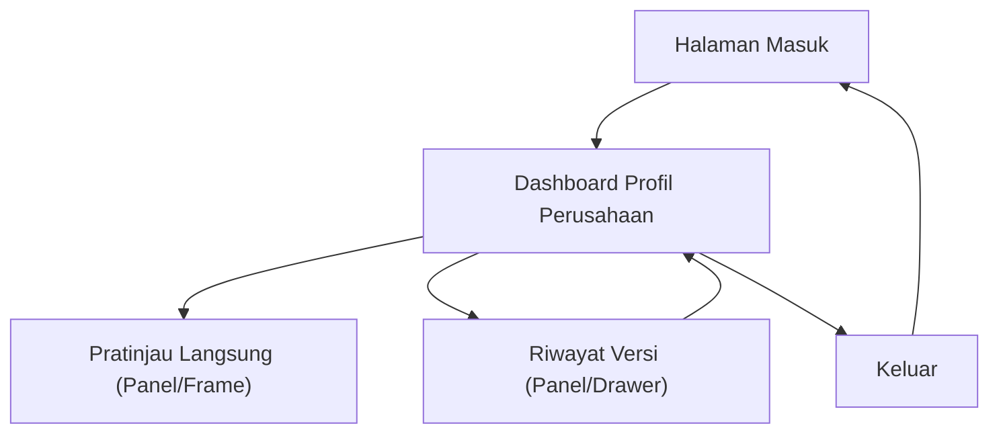

## 1. Product Overview
Dashboard internal untuk mengelola profil perusahaan dengan aman: edit konten, upload gambar, simpan draft/terbitkan dengan riwayat versi, serta pratinjau langsung yang responsif.
Ditujukan untuk admin/penanggung jawab konten agar perubahan profil perusahaan rapi, terkontrol, dan mudah dipublikasikan.

## 2. Core Features

### 2.1 User Roles
| Role | Registration Method | Core Permissions |
|------|---------------------|------------------|
| Admin Konten | Akun dibuat oleh sistem/owner (tanpa self-signup) | Login, mengedit konten profil, upload gambar, simpan draft, terbitkan, melihat & memulihkan versi, pratinjau responsif |

### 2.2 Feature Module
Kebutuhan dashboard terdiri dari halaman inti berikut:
1. **Halaman Masuk**: autentikasi, lupa kata sandi.
2. **Dashboard Profil Perusahaan**: editor konten, manajemen gambar, status draft/terbit, riwayat versi, pratinjau langsung responsif.

### 2.3 Page Details
| Page Name | Module Name | Feature description |
|-----------|-------------|---------------------|
| Halaman Masuk | Form autentikasi | Masuk menggunakan email + kata sandi; menampilkan error state yang jelas; menjaga sesi login.
|
| Halaman Masuk | Lupa kata sandi | Mengirim tautan reset kata sandi ke email; menampilkan konfirmasi pengiriman.
|
| Dashboard Profil Perusahaan | Shell & navigasi | Menampilkan header (nama perusahaan, status draft/terbit); tombol keluar; area kerja editor.
|
| Dashboard Profil Perusahaan | Editor konten profil | Mengubah field profil inti (mis. nama, deskripsi, alamat, kontak, tautan sosial); validasi wajib/format; autosave terkontrol (opsional) dan indikator “belum disimpan”.
|
| Dashboard Profil Perusahaan | Upload & pilih gambar | Mengunggah gambar (logo/cover/galeri) dengan batas tipe/ukuran; menampilkan daftar aset yang sudah diunggah; memilih gambar untuk dipakai pada profil; menghapus aset yang tidak dipakai.
|
| Dashboard Profil Perusahaan | Draft & terbitkan | Menyimpan sebagai draft tanpa memengaruhi publik; menerbitkan versi tertentu; menampilkan timestamp dan siapa yang menerbitkan.
|
| Dashboard Profil Perusahaan | Riwayat versi | Membuat snapshot versi saat simpan/terbit; menampilkan daftar versi (draft/terbit); melihat ringkasan perubahan; memulihkan versi lama sebagai draft baru.
|
| Dashboard Profil Perusahaan | Pratinjau langsung responsif | Menampilkan pratinjau real-time dari perubahan (sebelum simpan/terbit); menyediakan switch perangkat (Desktop/Tablet/Mobile) atau resize frame; memastikan layout mengikuti breakpoint.

## 3. Core Process
**Alur Admin Konten**
1. Membuka halaman masuk dan login.
2. Masuk ke Dashboard Profil Perusahaan.
3. Mengedit konten dan/atau mengunggah gambar lalu memilihnya untuk dipakai.
4. Melihat perubahan di pratinjau langsung (desktop/tablet/mobile) dan memperbaiki bila perlu.
5. Menyimpan sebagai draft (membuat versi baru).
6. Membuka riwayat versi untuk meninjau atau memulihkan versi tertentu.
7. Menerbitkan versi yang sudah final.

