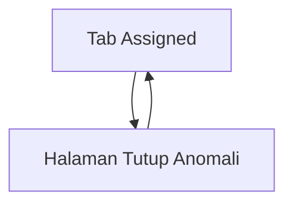

## 1. Product Overview
Fitur “Tutup Anomali” memungkinkan kamu menutup item anomali dari tab Assigned.
Dari tombol aksi, kamu dibawa ke halaman baru untuk mengunggah dokumen PDF dan mengisi tanggal pekerjaan, dengan status loading dan pesan error yang jelas.

## 2. Core Features

### 2.1 Feature Module
Kebutuhan fitur ini terdiri dari halaman utama berikut:
1. **Tab Assigned**: daftar anomali yang di-assign, tombol **Tutup Anomali** per item.
2. **Halaman Tutup Anomali**: form upload PDF, input tanggal pekerjaan, validasi, submit, state loading/error/sukses.

### 2.2 Page Details
| Page Name | Module Name | Feature description |
|---|---|---|
| Tab Assigned | Tombol “Tutup Anomali” | Membuka halaman baru “Tutup Anomali” untuk item yang dipilih. |
| Halaman Tutup Anomali | Konteks anomali | Menampilkan ringkas info anomali yang akan ditutup (mis. ID/judul) agar kamu yakin item yang benar. |
| Halaman Tutup Anomali | Upload PDF | Memilih file PDF untuk lampiran penutupan. • Memvalidasi tipe file PDF • Menolak file kosong/tidak valid dan menampilkan pesan error. |
| Halaman Tutup Anomali | Input tanggal pekerjaan | Mengisi tanggal pekerjaan. • Memvalidasi wajib isi • Memastikan format tanggal valid. |
| Halaman Tutup Anomali | Submit penutupan | Mengirim data penutupan (PDF + tanggal). • Menampilkan loading saat proses • Menampilkan error jika gagal • Menampilkan sukses dan kembali ke tab Assigned. |

## 3. Core Process
Alur utama:
1. Kamu membuka **tab Assigned** dan memilih anomali yang ingin ditutup.
2. Kamu menekan tombol **Tutup Anomali** pada item tersebut.
3. Sistem membuka **halaman Tutup Anomali**.
4. Kamu mengunggah **file PDF** dan mengisi **tanggal pekerjaan**.
5. Kamu menekan **Submit**.
6. Sistem menampilkan **loading** saat unggah/penyimpanan berlangsung.
7. Jika validasi gagal atau proses unggah/penyimpanan gagal, sistem menampilkan **pesan error** yang spesifik.
8. Jika berhasil, sistem menampilkan **sukses** lalu mengarahkan kamu kembali ke **tab Assigned**.

