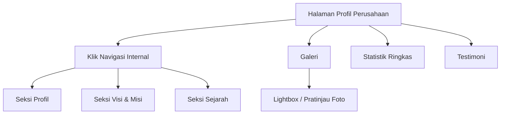

## 1. Product Overview
Halaman “Profil Perusahaan PLN UPT Karawang” menampilkan informasi inti unit secara ringkas, kredibel, dan mudah dinavigasi.
Pengunjung dapat memahami profil, visi-misi, sejarah, serta melihat galeri, statistik ringkas (placeholder), dan testimoni.

## 2. Core Features

### 2.1 User Roles
Tidak memerlukan pembedaan peran pengguna (konten informatif publik).

### 2.2 Feature Module
Kebutuhan halaman utama terdiri dari:
1. **Halaman Profil Perusahaan**: navigasi internal (anchor), seksi Profil, seksi Visi & Misi, seksi Sejarah, galeri, statistik ringkas, testimoni.

### 2.3 Page Details
| Page Name | Module Name | Feature description |
|-----------|-------------|---------------------|
| Halaman Profil Perusahaan | Header + Identitas Halaman | Menampilkan judul halaman, ringkasan singkat, dan tautan cepat ke seksi utama. |
| Halaman Profil Perusahaan | Navigasi Internal (Anchor) | Melompat ke seksi **Profil**, **Visi & Misi**, **Sejarah**, serta blok **Galeri**, **Statistik**, **Testimoni**; menandai seksi aktif saat pengguna scroll. |
| Halaman Profil Perusahaan | Seksi Profil | Menjelaskan gambaran umum unit dengan paragraf terstruktur (mis. “Tugas Utama”, “Lingkup Layanan”, “Nilai Kerja”); menggunakan placeholder berbasis poin tanpa angka spesifik. |
| Halaman Profil Perusahaan | Seksi Visi & Misi | Menampilkan 1 visi dan daftar misi (bullet) yang dapat dipindai; menyediakan placeholder teks yang mudah diganti. |
| Halaman Profil Perusahaan | Seksi Sejarah | Menampilkan timeline ringkas per periode (mis. “Tahun [YYYY]” atau “Periode [P1]”) dengan deskripsi singkat; tanpa klaim angka/kejadian spesifik tanpa sumber. |
| Halaman Profil Perusahaan | Galeri | Menampilkan grid foto (thumbnail) dengan caption; membuka pratinjau (lightbox/modal) saat diklik; menyediakan placeholder data (judul, deskripsi, kredit sumber). |
| Halaman Profil Perusahaan | Statistik Ringkas | Menampilkan kartu statistik dengan label dan nilai placeholder (mis. “[N]”, “[X%]”, “[YYYY]”); menyertakan catatan “Sumber: [tautan/rujukan]” atau “Sumber belum ditetapkan”. |
| Halaman Profil Perusahaan | Testimoni | Menampilkan daftar testimoni (kutipan) dengan nama/instansi placeholder; mendukung carousel sederhana atau daftar kartu. |
| Halaman Profil Perusahaan | Footer | Menampilkan informasi kontak/tautan kebijakan (placeholder) dan kredit sumber konten bila ada. |

## 3. Core Process
**Alur Pengunjung (Publik):**
1. Membuka halaman Profil Perusahaan.
2. Menggunakan navigasi internal untuk melompat ke seksi Profil / Visi & Misi / Sejarah.
3. Melihat Galeri (klik foto untuk pratinjau lebih besar dan membaca caption/kredit).
4. Membaca Statistik Ringkas (melihat catatan sumber atau placeholder sumber).
5. Membaca Testimoni.

