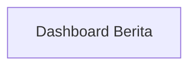

## 1. Product Overview
Redesign halaman Dashboard Berita agar tampilan list/grid/table konsisten dengan tema/branding website, responsif, dan mudah diakses.
Fokus utama: pengalaman membaca/memindai daftar berita yang stabil melalui state loading/empty/error serta aksesibilitas.

## 2. Core Features

### 2.1 Feature Module
Kebutuhan halaman terdiri dari:
1. **Dashboard Berita**: header halaman, kontrol tampilan (list/grid/table), area konten daftar berita, state loading/empty/error, dan perilaku aksesibilitas.

### 2.2 Page Details
| Page Name | Module Name | Feature description |
|-----------|-------------|---------------------|
| Dashboard Berita | Struktur & Branding | Menampilkan judul halaman dan gaya visual konsisten (warna, tipografi, komponen, dan spacing) dengan tema/branding website. |
| Dashboard Berita | Kontrol Tampilan | Mengganti mode tampilan daftar berita (list / grid / table) tanpa mengubah konteks halaman. |
| Dashboard Berita | Daftar Berita (List) | Menampilkan item berita sebagai baris ringkas yang mudah dipindai; mendukung responsif dan fokus pada keterbacaan. |
| Dashboard Berita | Daftar Berita (Grid) | Menampilkan item berita dalam kartu-kartu; menyesuaikan jumlah kolom sesuai breakpoint agar stabil dan rapi. |
| Dashboard Berita | Daftar Berita (Table) | Menampilkan item berita dalam tabel dengan struktur semantik yang benar; tetap dapat digunakan pada layar kecil (mis. scroll horizontal aman). |
| Dashboard Berita | State: Loading | Menampilkan skeleton/progress yang konsisten untuk tiap mode tampilan selama data dimuat, tanpa layout shift berlebihan. |
| Dashboard Berita | State: Empty | Menampilkan pesan kosong yang informatif saat tidak ada data, dengan ajakan tindakan yang aman (mis. muat ulang) tanpa menambah fitur baru. |
| Dashboard Berita | State: Error | Menampilkan error message yang jelas, opsi coba lagi, dan menjaga aksesibilitas (announce ke screen reader). |
| Dashboard Berita | Aksesibilitas | Mendukung navigasi keyboard, fokus terlihat, label ARIA yang tepat, kontras warna memadai, serta dukungan reduced motion. |

## 3. Core Process
Alur pengguna pada halaman Dashboard Berita:
1. Kamu membuka Dashboard Berita.
2. Sistem memuat data berita dan menampilkan state loading sesuai mode tampilan saat ini.
3. Setelah data tersedia, kamu melihat daftar berita dalam mode default.
4. Kamu dapat mengganti mode tampilan (list/grid/table); konten yang sama dirender dengan layout berbeda.
5. Jika data kosong, kamu melihat empty state yang menjelaskan kondisi.
6. Jika terjadi kegagalan pemuatan, kamu melihat error state dan dapat mencoba memuat ulang.

