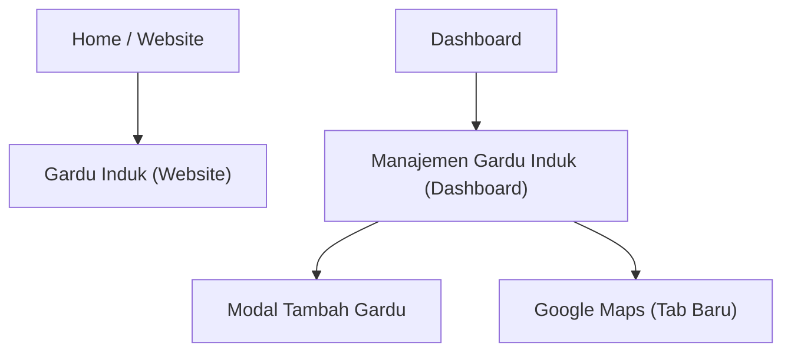

## 1. Product Overview
Redesain UI halaman Gardu Induk (Website & Dashboard) agar konsisten dengan tema aplikasi yang sudah ada.
Fokus pada standardisasi palet warna, tipografi, komponen reusable, dan perilaku responsif tanpa mengubah fitur inti.

## 2. Core Features

### 2.1 User Roles
| Role | Registration Method | Core Permissions |
|------|---------------------|------------------|
| Pengunjung Website | Tanpa login | Melihat peta Gardu Induk, memfilter data, melihat detail via popup peta |
| Admin Dashboard | Login aplikasi | Melihat daftar gardu induk, mencari data, mengatur jumlah baris, pagination, menambah gardu induk, membuka lokasi via Google Maps |

### 2.2 Feature Module
Kebutuhan redesain terdiri dari halaman utama berikut:
1. **Gardu Induk (Website)**: header halaman, filter (ULTG & kondisi), peta + marker, popup ringkas, legend/status, empty state.
2. **Manajemen Gardu Induk (Dashboard)**: header halaman + CTA, tabel daftar, pencarian (di panel filter), selector jumlah baris, pagination, empty state, modal “Tambah Gardu Induk”, tautan “Maps”.

### 2.3 Page Details
| Page Name | Module Name | Feature description |
|-----------|-------------|------------------|
| Gardu Induk (Website) | Visual Identity Alignment | Menyeragamkan warna primary/accent, typographic scale, radius, shadow, dan state interaksi agar sejalan dengan tema aplikasi. |
| Gardu Induk (Website) | Header Halaman | Menampilkan judul “Peta Gardu Induk” dan deskripsi singkat dengan hierarchy tipografi konsisten. |
| Gardu Induk (Website) | Filter (ULTG & Kondisi) | Memfilter marker yang tampil berdasarkan ULTG dan kondisi menggunakan komponen select (Listbox) yang reusable dan aksesibel. |
| Gardu Induk (Website) | Peta + Marker + Popup | Menampilkan peta, marker gardu induk, serta popup yang memuat nama, ULTG, dan badge kondisi. |
| Gardu Induk (Website) | Legend & Empty State | Menampilkan legend status serta pesan ketika hasil filter kosong, menggunakan komponen status/badge yang konsisten. |
| Manajemen Gardu Induk (Dashboard) | Visual Identity Alignment | Menyeragamkan warna primary/accent, typographic scale, radius, shadow, dan state komponen agar konsisten dengan layout dashboard (header/sidebar). |
| Manajemen Gardu Induk (Dashboard) | Page Header + CTA | Menampilkan judul, deskripsi, ikon, dan tombol “Tambah Gardu” dengan gaya tombol standar aplikasi. |
| Manajemen Gardu Induk (Dashboard) | Panel Daftar (Table Card) | Menampilkan ringkasan total data, kontrol filter/cari, kontrol jumlah baris, tabel, dan empty state. |
| Manajemen Gardu Induk (Dashboard) | Pencarian | Mencari data berdasarkan nama gardu induk melalui input pencarian di panel filter. |
| Manajemen Gardu Induk (Dashboard) | Pagination | Menavigasi halaman data (prev/next) dan menampilkan ringkasan rentang data yang sedang terlihat. |
| Manajemen Gardu Induk (Dashboard) | Aksi “Maps” | Membuka Google Maps pada koordinat latitude/longitude pada tab baru. |
| Manajemen Gardu Induk (Dashboard) | Modal Tambah Gardu | Mengisi form (Nama, Latitude, Longitude, ULTG, Kondisi) lalu menyimpan; menampilkan validasi error pada field terkait. |

## 3. Core Process
**Flow Pengunjung (Website)**
1) Membuka halaman Gardu Induk.
2) Memilih filter ULTG dan/atau Kondisi.
3) Melihat marker yang tersaring di peta.
4) Klik marker untuk melihat popup ringkas (nama, ULTG, kondisi).

**Flow Admin (Dashboard)**
1) Masuk ke Dashboard.
2) Membuka menu “Gardu Induk”.
3) Melihat daftar dalam tabel, menggunakan pencarian bila perlu.
4) Mengubah jumlah baris per halaman dan berpindah halaman dengan pagination.
5) Klik “Tambah Gardu” untuk membuka modal, mengisi form, lalu simpan.
6) Klik “Maps” pada baris untuk membuka lokasi.

