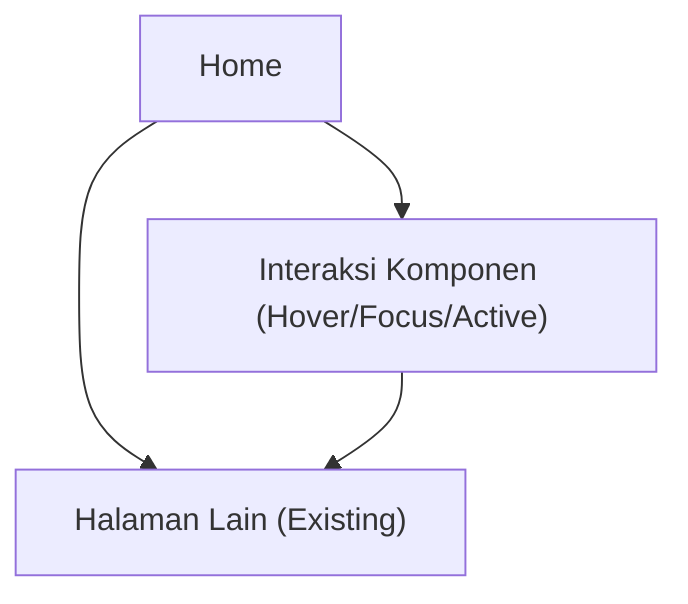

## 1. Product Overview
Redesain UI halaman Home agar konsisten secara visual dengan halaman lain.
Fokus pada standarisasi palet warna, tipografi, spacing, komponen reusable, serta perilaku responsif.

## 2. Core Features

### 2.1 Feature Module
Kebutuhan redesain ini terdiri dari halaman berikut:
1. **Home**: penerapan sistem visual (warna, tipografi, spacing), komponen reusable, dan responsif.

### 2.2 Page Details
| Page Name | Module Name | Feature description |
|-----------|-------------|---------------------|
| Home | Visual Consistency Baseline | Menyamakan tampilan dengan halaman lain melalui token desain (warna, tipografi, spacing) dan aturan penggunaan yang konsisten. |
| Home | Color Palette & States | Menerapkan palet warna utama/sekunder/netral serta state (hover, active, disabled, focus) pada elemen UI. |
| Home | Typography System | Menerapkan skala tipografi (heading, body, caption) beserta aturan line-height, font-weight, dan panjang baris agar konsisten. |
| Home | Spacing & Layout Grid | Menerapkan sistem spacing (berbasis 4/8px), container width, dan grid layout agar ritme visual rapi di seluruh section. |
| Home | Reusable Components | Menggunakan komponen reusable (mis. Button, Card, Section Header, Badge/Tag, Link, Form Control bila ada) dengan varian dan state yang seragam. |
| Home | Responsive Behavior | Menjamin layout dan komponen beradaptasi pada breakpoint (desktop-first) dengan aturan stack, wrap, dan pengaturan densitas konten. |
| Home | Accessibility Basics | Menjamin kontras warna memadai, fokus keyboard terlihat, dan hierarchy heading rapi untuk keterbacaan. |

## 3. Core Process
Alur utama pengguna:
1. Pengguna membuka halaman Home dan langsung melihat hierarchy visual yang konsisten (warna, tipografi, jarak).
2. Pengguna berinteraksi dengan komponen inti (tautan, tombol, kartu konten) dengan state yang jelas (hover/focus/active).
3. Pengguna berpindah ke halaman lain melalui navigasi/CTA, dengan pengalaman visual yang tetap konsisten.

