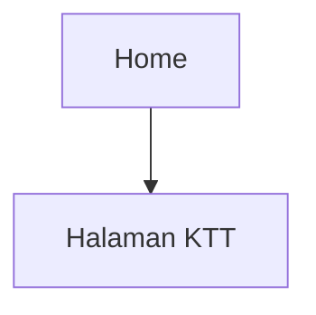

## 1. Product Overview
Redesain UI halaman KTT agar konsisten dengan tema aplikasi dan terasa modern.
Fokus pada palet warna, tipografi, layout responsif, style card (gradient/shadow), serta micro-interactions.

## 2. Core Features

### 2.1 Feature Module
Kebutuhan halaman untuk redesain ini terdiri dari:
1. **Halaman KTT**: header + hirarki judul, layout konten responsif, kartu konten konsisten (gradient/shadow), state interaksi (hover/focus/active), dan konsistensi tipografi/warna.

### 2.3 Page Details
| Page Name | Module Name | Feature description |
|-----------|-------------|------------------|
| Halaman KTT | Theme alignment | Menyamakan palet warna (primer/sekunder/aksen), warna latar, dan warna teks agar konsisten dengan tema aplikasi. |
| Halaman KTT | Typography system | Menetapkan hirarki tipografi (H1/H2/body/caption), weight, line-height, dan penggunaan huruf besar-kecil yang konsisten untuk judul/label. |
| Halaman KTT | Responsive layout | Menyusun layout desktop-first dengan grid/card yang adaptif untuk tablet dan mobile (reflow, spacing, dan max-width konten). |
| Halaman KTT | Card visual language | Mendesain kartu konten dengan radius, gradient halus, shadow bertingkat, dan border/outline ringan agar konsisten antar komponen. |
| Halaman KTT | Micro-interactions | Memberi transisi halus pada hover/press/focus (elevate card, perubahan shadow/gradient, fokus aksesibilitas) tanpa mengubah alur fungsi. |
| Halaman KTT | States & accessibility | Menyediakan state konsisten untuk default/hover/active/disabled/loading, serta fokus keyboard yang jelas dan kontras warna memadai. |

## 3. Core Process
Alur pengguna:
1. Kamu membuka halaman KTT dari navigasi aplikasi.
2. Kamu melihat konten KTT dalam layout kartu yang rapi dan konsisten.
3. Kamu berinteraksi dengan elemen UI (kartu/tombol/tautan) dengan umpan balik visual yang halus (hover, fokus keyboard, dan klik).

