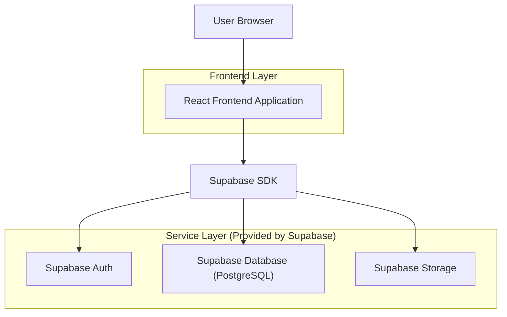
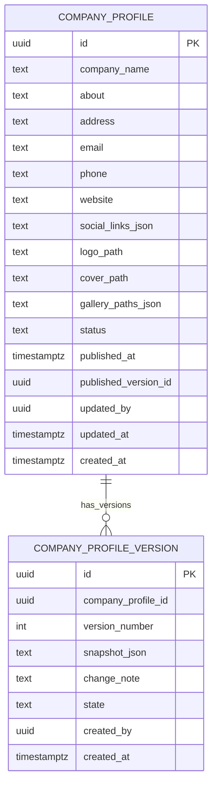

## 1.Architecture design


## 2.Technology Description
- Frontend: React@18 + TypeScript + vite + tailwindcss@3
- Backend: Supabase (Auth + PostgreSQL + Storage)

## 3.Route definitions
| Route | Purpose |
|-------|---------|
| /login | Halaman masuk dan reset kata sandi |
| /dashboard/profile | Area kerja pengelolaan profil: editor, upload gambar, riwayat versi, pratinjau responsif |

## 6.Data model(if applicable)

### 6.1 Data model definition


### 6.2 Data Definition Language
Company Profile (company_profiles)
```
CREATE TABLE company_profiles (
  id UUID PRIMARY KEY DEFAULT gen_random_uuid(),
  company_name TEXT NOT NULL,
  about TEXT,
  address TEXT,
  email TEXT,
  phone TEXT,
  website TEXT,
  social_links_json TEXT,
  logo_path TEXT,
  cover_path TEXT,
  gallery_paths_json TEXT,
  status TEXT NOT NULL DEFAULT 'draft',
  published_at TIMESTAMPTZ,
  published_version_id UUID,
  updated_by UUID,
  updated_at TIMESTAMPTZ DEFAULT NOW(),
  created_at TIMESTAMPTZ DEFAULT NOW()
);

CREATE INDEX idx_company_profiles_status ON company_profiles(status);
CREATE INDEX idx_company_profiles_updated_at ON company_profiles(updated_at DESC);

-- 권한 (contoh sesuai guideline)
GRANT SELECT ON company_profiles TO anon;
GRANT ALL PRIVILEGES ON company_profiles TO authenticated;
```

Company Profile Versions (company_profile_versions)
```
CREATE TABLE company_profile_versions (
  id UUID PRIMARY KEY DEFAULT gen_random_uuid(),
  company_profile_id UUID NOT NULL,
  version_number INTEGER NOT NULL,
  snapshot_json TEXT NOT NULL,
  change_note TEXT,
  state TEXT NOT NULL DEFAULT 'draft',
  created_by UUID,
  created_at TIMESTAMPTZ DEFAULT NOW()
);

CREATE INDEX idx_company_profile_versions_profile_id ON company_profile_versions(company_profile_id);
CREATE INDEX idx_company_profile_versions_created_at ON company_profile_versions(created_at DESC);

GRANT SELECT ON company_profile_versions TO anon;
GRANT ALL PRIVILEGES ON company_profile_versions TO authenticated;
```

Storage
- Bucket: company-assets
- Path convention (contoh): company/{company_profile_id}/logo/*, cover/*, gallery/*
