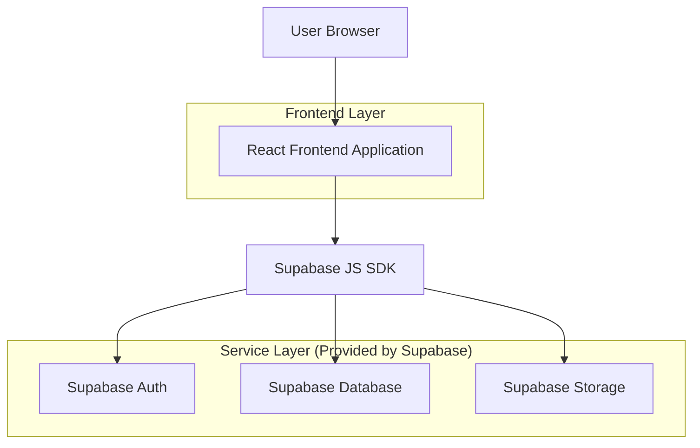
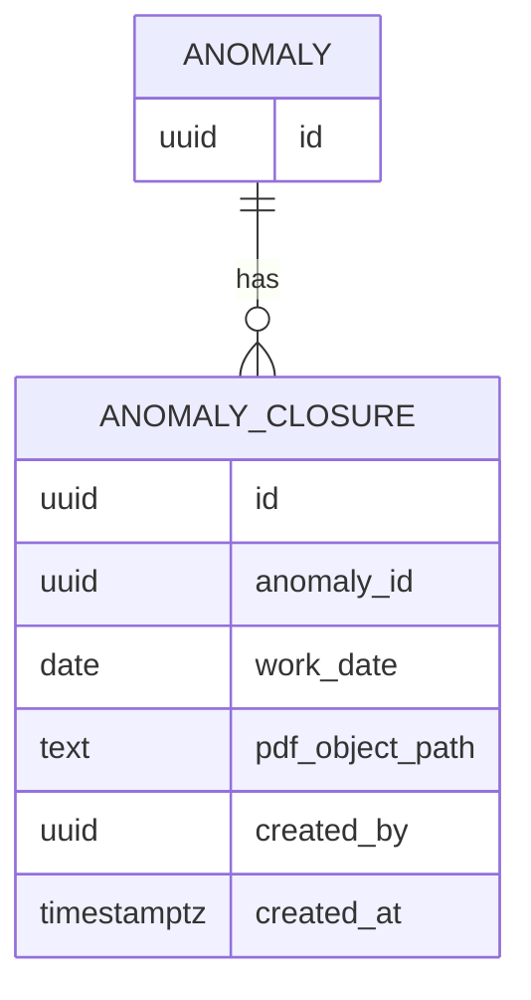

## 1.Architecture design


## 2.Technology Description
- Frontend: React@18 + TypeScript + (router sesuai proyek) + (UI kit sesuai proyek)
- Backend: Supabase (Auth + PostgreSQL + Storage)

## 3.Route definitions
| Route | Purpose |
|---|---|
| /assigned | Menampilkan tab/halaman Assigned dengan daftar item dan tombol “Tutup Anomali”. |
| /anomali/:anomalyId/tutup | Halaman form penutupan: upload PDF + input tanggal pekerjaan + submit. |

## 6.Data model(if applicable)

### 6.1 Data model definition


### 6.2 Data Definition Language
Anomaly closure table (anomaly_closures)
```
CREATE TABLE anomaly_closures (
  id UUID PRIMARY KEY DEFAULT gen_random_uuid(),
  anomaly_id UUID NOT NULL,
  work_date DATE NOT NULL,
  pdf_object_path TEXT NOT NULL,
  created_by UUID NOT NULL,
  created_at TIMESTAMPTZ NOT NULL DEFAULT NOW()
);

CREATE INDEX idx_anomaly_closures_anomaly_id ON anomaly_closures(anomaly_id);
CREATE INDEX idx_anomaly_closures_created_by ON anomaly_closures(created_by);
```

Storage
- Bucket: `anomaly-closures`
- Object path (contoh): `anomalies/{anomalyId}/closure/{closureId}.pdf`

Akses (sesuai pedoman Supabase)
```
GRANT SELECT ON anomaly_closures TO anon;
GRANT ALL PRIVILEGES ON anomaly_closures TO authenticated;
```

Catatan implementasi inti (frontend)
- Validasi file: wajib dipilih, tipe `application/pdf` (atau ekstensi `.pdf` sebagai fallback), dan ukuran > 0.
- Validasi tanggal: wajib diisi, format tanggal valid.
- State: `idle | validating | uploading | saving | success | error`.
- Error handling:
  - Error validasi ditampilkan inline di bawah field.
  - Error unggah/DB ditampilkan sebagai alert/banner di atas form + tombol coba lagi.
- Loading:
  - Disable tombol Submit saat `uploading/saving`.
  - Tampilkan progress/spinner dan teks status (mis. “Mengunggah PDF…”, “Menyimpan penutupan…”).
