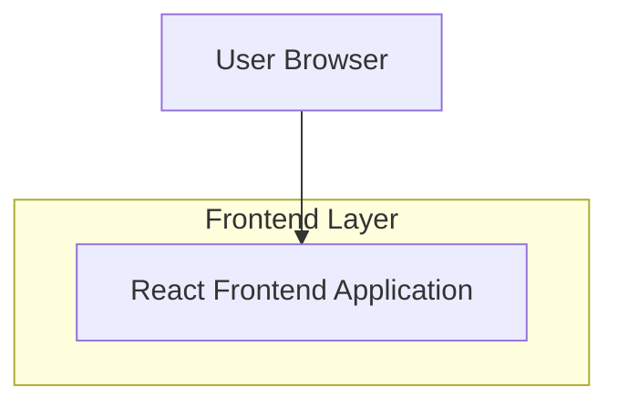

## 1.Architecture design

## 2.Technology Description
- Frontend: React@18 + tailwindcss@3 + vite
- Backend: None (konten statis/konfigurasi lokal)

## 3.Route definitions
| Route | Purpose |
|-------|---------|
| /profil-perusahaan-pln-upt-karawang | Halaman profil perusahaan berisi seksi Profil, Visi & Misi, Sejarah, Galeri, Statistik, Testimoni |

Catatan implementasi (frontend-only):
- Navigasi internal menggunakan anchor `#profil`, `#visi-misi`, `#sejarah`, `#galeri`, `#statistik`, `#testimoni`.
- Konten menggunakan data placeholder terstruktur (mis. file JSON/TS lokal) agar mudah diganti tanpa mengubah layout.
- Statistik wajib menampilkan field sumber: `sourceLabel` dan `sourceUrl` (boleh kosong bila belum tersedia).