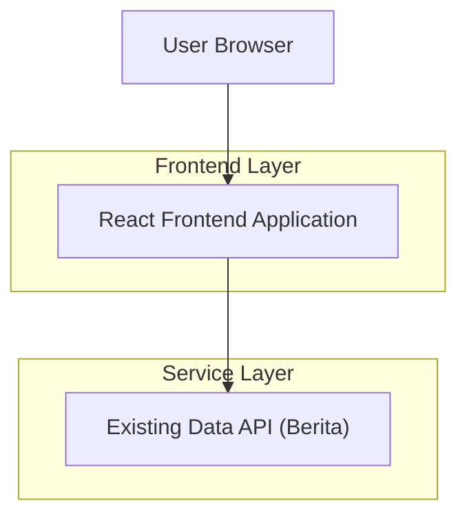

## 1.Architecture design

## 2.Technology Description
- Frontend: React@18 + TypeScript + vite
- Styling/UI: tailwindcss@3 (atau sistem token CSS yang sudah ada di website)
- Backend: None (redesign UI saja; konsumsi sumber data yang sudah ada)

## 3.Route definitions
| Route | Purpose |
|-------|---------|
| /dashboard/berita | Halaman Dashboard Berita dengan mode list/grid/table dan state UI (loading/empty/error) yang responsif dan aksesibel |
