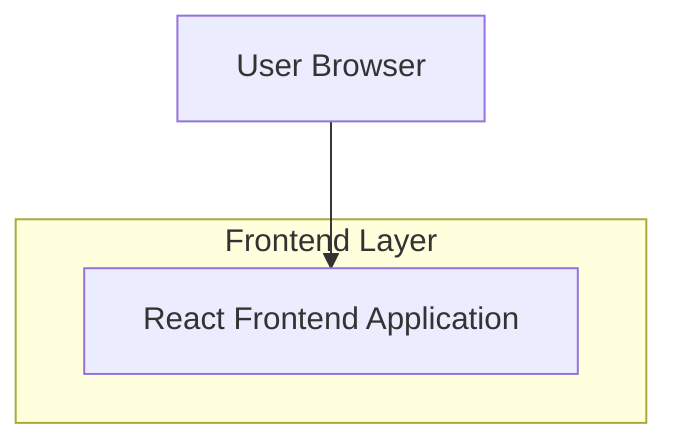

## 1.Architecture design

## 2.Technology Description
- Frontend: React@18 (atau versi yang sudah dipakai aplikasi) + sistem styling berbasis token (TailwindCSS atau CSS/SCSS Modules)
- Backend: None (redesain UI saja)

## 3.Route definitions
| Route | Purpose |
|-------|---------|
| /ktt | Menampilkan halaman KTT dengan layout kartu yang konsisten tema |

## 6.Data model(if applicable)
Tidak ada perubahan data model untuk redesain UI halaman KTT.
